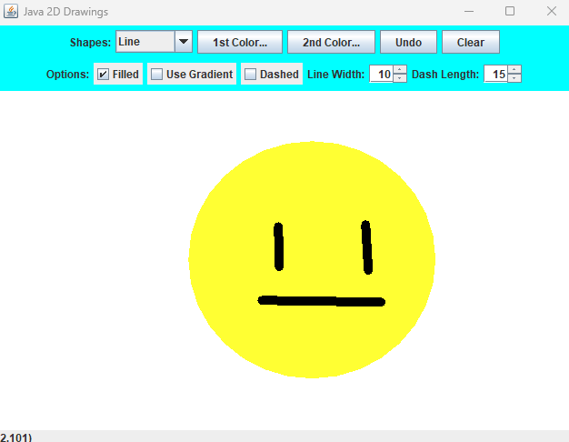

# Enhanced Java Swing Drawing Application

This project was originally developed as part of a **Penn State's CMPSC221 course**, with a few additional features added beyond the original requirements to enhance the original drawing application.  
It serves as a small portfolio piece demonstrating my hands-on experience with Java GUI development, using **Java Swing**, **object-oriented programming**, **event handling**, and **GUI application design**.

---

## Key Features

- **Drawing Shapes:** Lines, rectangles, and ovals with live preview while dragging the mouse.
- **Undo & Clear:** Remove the last shape or clear the entire canvas.
- **Color & Gradients:** Choose between solid colors or gradient fills using two selectable colors.
- **Customizable Strokes:** Adjust line width and add dash patterns for professional-looking graphics.
- **Keyboard Shortcuts:** Efficient workflow with:
  - `Ctrl+Z` → Undo  
  - `C` → Clear  
  - `Ctrl+S` → Save drawing as PNG 
- **Save Functionality:** Save your drawings as PNG images.
- **Responsive GUI:** Smooth mouse interactions and real-time shape rendering.

---

## Technologies & Concepts Highlighted

- **Java 8+** and **Swing GUI Toolkit**
- **OOP Principles:** Shape inheritance with `MyShapes`, `MyLine`, `MyOval`, `MyRectangle`
- **Event Handling:** MouseListener, MouseMotionListener, and Key Bindings
- **Graphics Programming:** Custom painting, gradients, strokes, and buffering
- **File I/O:** Save/load images using `BufferedImage` and `ImageIO`
- **Portfolio Practices:** Clean, maintainable code and enhanced user experience

---

## Demo

---

## Future Enhancements

- Add additional shapes like polygons, triangles, and freehand curves
- Layer management for more advanced drawing projects
- Transparency for drawn shapes 
- Export to multiple image formats
